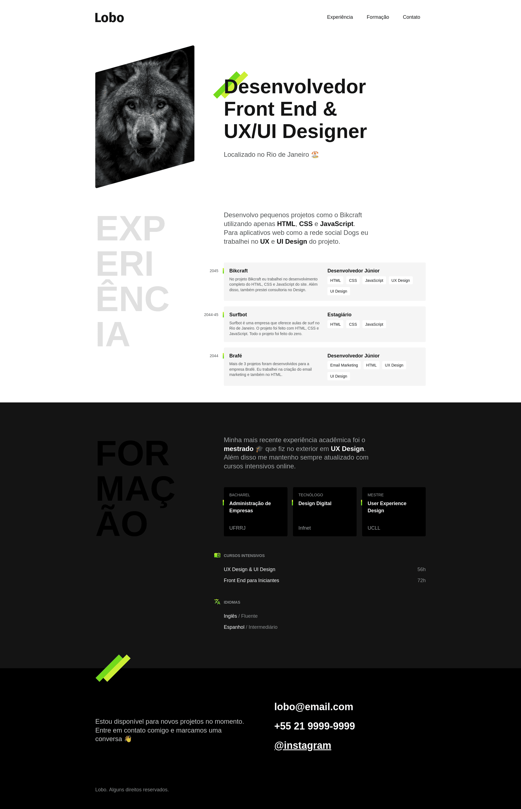

# Portfólio Lobo

Portfólio para exibição de informações profissionais de um desenvolvedor FrontEnd usando apenas HTML e CSS.

O protótipo desse projeto foi desenvolvido usando Figma no curso de [UI Design para Iniciantes](../../UI-Design-para-Iniciantes/README.md).

## Projeto final

