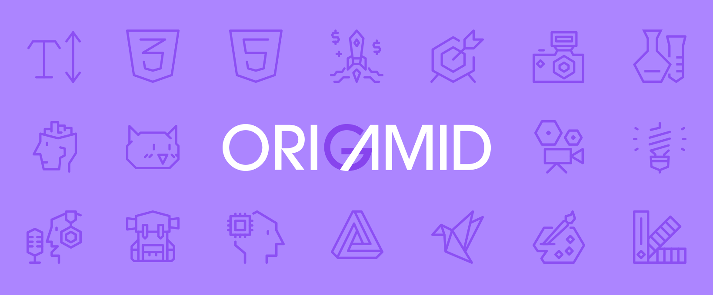

    <h1>Origamid</h1>
    
Projetos desenvolvidos no curso da <a href="https://www.origamid.com" target="_blank">Origamid</a>.

    
    
    
    

# Cursos

- [x] [UI Design para Iniciantes](./UI-Design-para-Iniciantes/README.md)
- [x] [HTML e CSS para Iniciantes](./HTML-e-CSS-para-Iniciantes/README.md)
